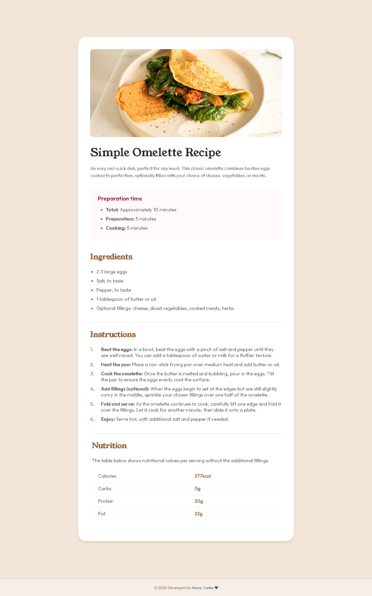

# Recipe Page Project

This project is a solution to the [Recipe page challenge on Frontend Mentor](https://www.frontendmentor.io/challenges/recipe-page-KiTsR8QQKm). Frontend Mentor challenges are designed to help you enhance your coding skills by creating realistic projects.

## Overview

### Screenshot

### Links

- [Solution URL](https://your-solution-url.com)
- [Live Site URL](https://your-live-site-url.com)

## Project Details

### Built with

- Semantic HTML5 markup
- CSS custom properties
- Flexbox
- CSS Grid
- Mobile-first workflow

## Learnings

During this project, I gained insights into various aspects of web development. Here are a few highlights:

- Utilizing Semantic HTML5 to structure content efficiently.
- Employing CSS custom properties for easier styling management.
- Implementing Flexbox and CSS Grid for layout flexibility.
- Adhering to a mobile-first workflow for better responsiveness.

## Future Improvements

In future projects, I aim to focus on:

- Enhancing my proficiency in CSS Grid layouts.
- Exploring advanced styling techniques with Styled Components.

## Helpful Resources

- [MDN Web Docs](https://developer.mozilla.org/): A comprehensive resource for web development.
- [Frontend Mentor](https://www.frontendmentor.io/): Offers challenges and resources to improve frontend skills.
- [Styled Components Documentation](https://styled-components.com/docs): Official documentation for Styled Components.

## Author

- [Kenzy Codex ❤](https://wa.me/2347064538411)
- Frontend Mentor - [@yourusername](https://www.frontendmentor.io/profile/kenzycodex)

## Acknowledgments

Special thanks to all my coding mentors ❤.